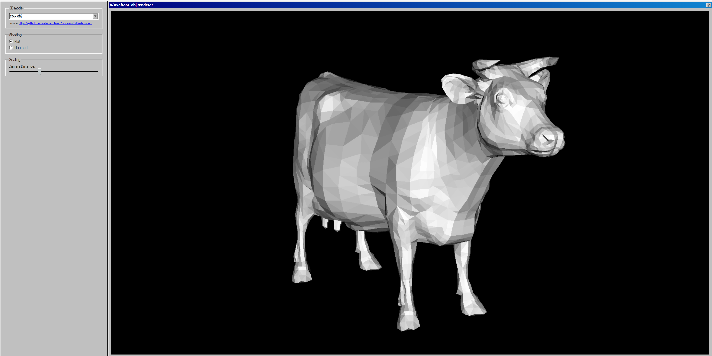

# Wavefront 3D Viewer

[](https://creeston.github.io/wavefront-3d-renderer/)

Wavefront 3D Viewer is a C application designed for rendering 3D objects from Wavefront .obj file format. This application allows users to rotate, scale, and choose between different shading types. This project was created for educational purposes to demonstrate the fundamentals of 3D rendering and manipulation.

## Features

- Render 3D objects from Wavefront .obj files
- Rotate and scale 3D objects
- Choose between different shading modes
- Different application interfaces (GTK and Web)

## Technologies

- [C](https://en.wikipedia.org/wiki/C_(programming_language))
- [GTK-3](https://docs.gtk.org/gtk3/)
- [Glade](https://glade.gnome.org/)
- [SDL2](https://www.libsdl.org/)
- [Emscripten](https://emscripten.org/)
- [98.css](https://jdan.github.io/98.css/)


## Screenshots

### GTK UI:


Model used in the screenshot: [Cat v1](https://free3d.com/3d-model/cat-v1--522281.html)

### Web UI (WASM):



Model used in the screenshot: [cow.obj](https://github.com/alecjacobson/common-3d-test-models/blob/master/data/cow.obj)


## Running

### Dependencies

#### Ubuntu

To compile GTK application

```sh
sudo apt-get install libgtk-3-dev
```

To compile SDL2 application

```sh
sudo apt-get install libsdl2-dev
```

To compile WebAssembly application you need to install Emscripten SDK. Follow the instructions on the [official website](https://emscripten.org/docs/getting_started/downloads.html).


To install debugger

```sh
sudo apt install gdb
```

#### Mac (Arm64)

Use `brew` package manager to install required dependencies.

```sh
brew install cmake
brew instal pkg-config
brew install gtk+3
```

#### Windows

Use WSL AND follow same steps as for **Ubuntu**.

### Build

Using `make` to build the project.

To compile GTK application

```sh
make app-gtk
```

To compile SDL2 application

```sh
make app-sdl
```

To compile WebAssembly application

```sh
make app-web
```

To delete compiled files

```sh
make clean
```

### Run

#### GTK

```sh
./app-gtk
```

#### SDL2

```sh
./app-sdl --file path/to/obj/file.obj --width 800 --height 600
```

#### WebAssembly

Serve the `index.html` file using a local server.

```sh
cd docs
python3 -m http.server
```


## Source for 3D Objects

- [Free 3D](https://free3d.com/)
- [alecjacobson/common-3d-test-models](https://github.com/alecjacobson/common-3d-test-models)

## License

This project is licensed under the MIT License.