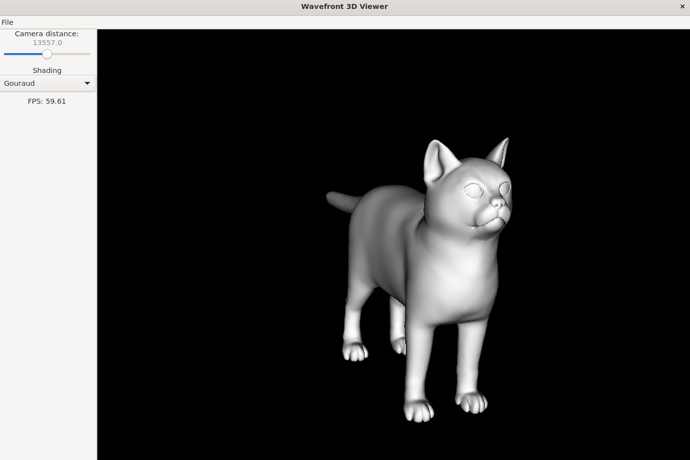

# Wavefront 3D Viewer

Wavefront 3D Viewer is a C application designed for rendering 3D objects from Wavefront .obj file format. This application allows users to rotate, scale, and choose between different shading types. This project was created for educational purposes to demonstrate the fundamentals of 3D rendering and manipulation.

## Features

- Render 3D objects from Wavefront .obj files
- Rotate and scale 3D objects
- Choose between No Shading, Flat Shading, and Gouraud Shading

## Screenshots



Model used in the screenshot: [Cat v1](https://free3d.com/3d-model/cat-v1--522281.html)  

## Technologies

- [C](https://en.wikipedia.org/wiki/C_(programming_language))
- [GTK-3](https://docs.gtk.org/gtk3/)
- [Glade](https://glade.gnome.org/)
- [Make](https://www.gnu.org/software/make/)

## Running

### Dependencies

#### Ubuntu

```sh
sudo apt-get install libgtk-3-dev
sudo apt-get install glade
sudo apt-get install libsdl2-dev // for SDL2
```

To install debugger

```sh
sudo apt install gdb
```

#### Mac (Arm64)

Use `brew` package manager to install required dependencies.

```sh
brew install cmake
brew instal pkg-config
brew install gtk+3
```

#### Windows

Use WSL AND follow same steps as for Ubuntu.

### Build

Using `make` to build the project.

```sh
make all
```

To delete compiled files

```sh
make clean
```

### Run

```sh
./app
```

or

```sh
./app --file path/to/obj/file.obj
```

to start the application with a specific .obj file.

## Source for 3D Objects

- [Free 3D](https://free3d.com/)
- [alecjacobson/common-3d-test-models](https://github.com/alecjacobson/common-3d-test-models)

## License
This project is licensed under the MIT License.